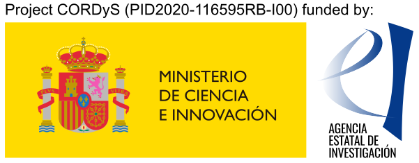

CORDyS
======

Contribution to the next generation of CORDEX regional climate projections: Dynamical and Statistical approaches
---
CORDEX is currently facing the downscaling of CMIP6 global climate models (GCMs), which represent the latest 
generation of Coupled Earth System Models. The CORDyS project, funded by the Spanish Ministry of Science and Innovation,
aims to contribute to this next generation of CORDEX regional climate projections using both dynamical and statistical
downscaling methods, including statistical emulators of the dynamical models. Our objective is to contribute to
(1) the process-based evaluation of the driving GCMs,
(2) the downscaling of future climate projections for the current standard continental-scale CORDEX EUR-11 domain,
(3) the further downscaling of future projections at very high resolution using a convection-permitting RCM and statistical emulators,
(4) the distillation of actionable regional climate information for impacts assessment from these new-generation sources, and
(5) the dissemination and publication of results and data products in the CORDEX community and ESGF infrastructure.
